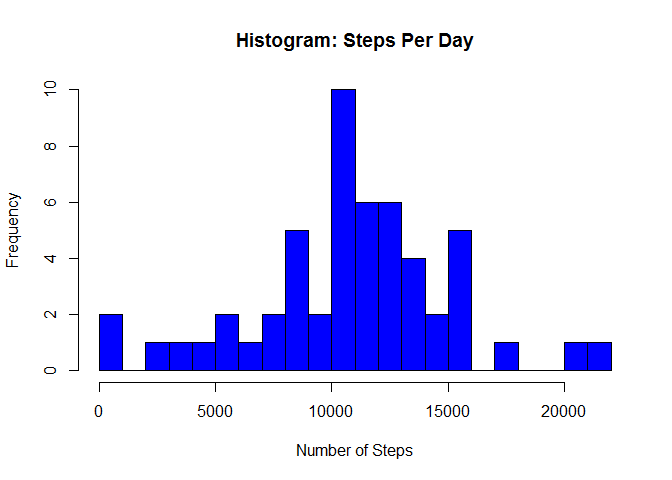
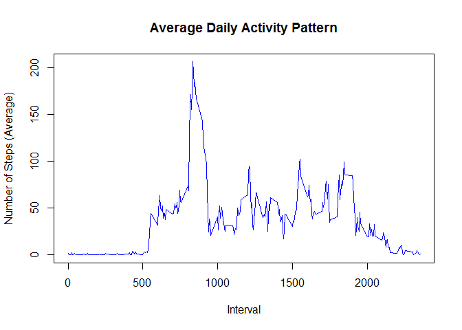
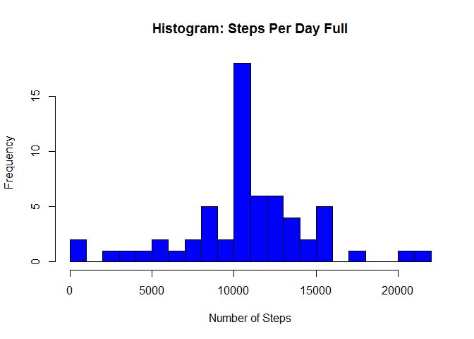

# Reproducible Research, Peer Assessment 1
Ron Yagur  
Friday, March 13, 2015  

###Introduction
It is now possible to collect a large amount of data about personal movement using activity monitoring devices such as a [Fitbit](http://www.fitbit.com/), [Nike Fuelband](http://www.nike.com/us/en_us/c/nikeplus-fuelband), or [Jawbone Up](https://jawbone.com/up). These type of devices are part of the "quantified self" movement - a group of enthusiasts who take measurements about themselves regularly to improve their health, to find patterns in their behavior, or because they are tech geeks. But these data remain under-utilized both because the raw data are hard to obtain and there is a lack of statistical methods and software for processing and interpreting the data.

###Data
The data for this assignment can be downloaded from the Reproducable Research course web site:
[Dataset: Activity monitoring data 52K](https://d396qusza40orc.cloudfront.net/repdata%2Fdata%2Factivity.zip)
The variables included in this dataset are:
-steps: Number of steps taking in a 5-minute interval (missing values are coded as NA)
-date: The date on which the measurement was taken in YYYY-MM-DD format
-interval: Identifier for the 5-minute interval in which measurement was taken
The dataset is stored in a comma-separated-value (CSV) file and there are a total of 17,568 observations in this dataset.

###Loading and preprocessing the data

```r
#Read the activity monitoring data from the CSV file
data <- read.csv("activity.csv", header = TRUE, sep = ",", na.strings = "NA")

#Summary of the data
summary(data)
```

```
##      steps                date          interval     
##  Min.   :  0.00   2012-10-01:  288   Min.   :   0.0  
##  1st Qu.:  0.00   2012-10-02:  288   1st Qu.: 588.8  
##  Median :  0.00   2012-10-03:  288   Median :1177.5  
##  Mean   : 37.38   2012-10-04:  288   Mean   :1177.5  
##  3rd Qu.: 12.00   2012-10-05:  288   3rd Qu.:1766.2  
##  Max.   :806.00   2012-10-06:  288   Max.   :2355.0  
##  NA's   :2304     (Other)   :15840
```

```r
#Process/transform the data into a format suitable for analysis
data$date <- as.Date(data$date, format = "%Y-%m-%d")
data$interval <- factor(data$interval)
```

###Calculating the total number of steps taken per day 

```r
#Subset the dataset to ignore missing values
missingval_index <- is.na(as.character(data$steps))
data1 <- data[!missingval_index,]

#Create a data frame containing the steps inforamtion for each day and naming of data frame columns
steps_per_day <- aggregate(steps ~ date, data = data1, sum)
#Adding column names to the created data frame
colnames(steps_per_day) <- c("date", "steps")

#Create a histogram, display Mean and Median information
hist(as.numeric(steps_per_day$steps), breaks = 20, col = "blue", xlab = "Number of Steps", main= "Histogram: Steps Per Day")
```

 

```r
#Mean
mean(steps_per_day$steps)
```

```
## [1] 10766.19
```

```r
#Median
median(steps_per_day$steps)
```

```
## [1] 10765
```
###The average daily activity pattern
1. Time series plot (i.e. type = "l") of the 5-minute interval (x-axis) and the average number of steps taken, averaged across all days (y-axis)
2. The 5-minute interval, on average across all the days in the dataset, containing the maximum number of steps

```r
#Calculate the average daily activity pattern and naming of data frame columns
steps_per_int <- aggregate(data1$steps, by=list(interval=data1$interval), FUN=mean)
colnames(steps_per_int) <- c("interval", "steps_avg")

#Create a plot with the average daily activity pattern data 
plot(as.integer(levels(steps_per_int$interval)), steps_per_int$steps_avg, type="l",
     xlab = "Interval", ylab = "Number of Steps (Average)", main = "Average Daily Activity Pattern",  col ="blue")
```

 

```r
#Calculate the 5 minute interval containing the maximum number of steps on average across all the days in the dataset
#*msteps <- max(steps_per_int$steps_avg)
#int_msteps<-steps_per_int[which.max(steps_per_int$steps_avg),]$interval
#int_msteps
with(steps_per_int,steps_per_int[steps_avg == max(steps_avg),])
```

```
##     interval steps_avg
## 104      835  206.1698
```
###Imputing missing values
1. Report the total number of missing values in the dataset (i.e. the total number of rows with NAs)
2. New dataset with the missing data filled in.
3. Histogram of the total number of steps taken each day with mean and median. Explanation on differences with original data.

```r
#Number of missing values in the dataset
sum(is.na(as.character(data$steps)))
```

```
## [1] 2304
```

```r
#Fill the missing values with the mean value for that interval
index_NA <- which(is.na(as.character(data$steps)))
data2 <- data
data2[index_NA, ]$steps<-unlist(lapply(index_NA, FUN=function(index_NA){
                steps_per_int[data[index_NA,]$interval==steps_per_int$interval,]$steps_avg}))
#Create a data frame containing the steps inforamtion for each day and naming of data frame columns
steps_per_day_full <- aggregate(steps ~ date, data = data2, sum)
#Adding column names to the created data frame
colnames(steps_per_day_full) <- c("date", "steps")

#Create a histogram, display Mean and Median information
hist(as.numeric(steps_per_day_full$steps), breaks = 20, col = "blue", xlab = "Number of Steps", main= "Histogram: Steps Per Day Full")
```

 

```r
#Mean
mean(steps_per_day_full$steps)
```

```
## [1] 10766.19
```

```r
#Median
median(steps_per_day_full$steps)
```

```
## [1] 10766.19
```
####Summary: We can see that there are no differences in the mean between the datasets and minimal difference in the median

###Differences in activity patterns between weekdays and weekends
1. Create a new factor variable in the dataset with two levels - "weekday" and "weekend" indicating whether a given date is a weekday or weekend day.
2. Make a panel plot containing a time series plot (i.e. type = "l") of the 5-minute interval (x-axis) and the average number of steps taken, averaged across all weekday days or weekend days (y-axis). 

```r
#Create a factor variable to store the day of the week:
data2$day <- as.factor(weekdays(data2$date))

#Creating a logical variable "is_weekday" (weekday=TRUE, weekend = FALSE) :
data2$is_weekday <- ifelse(!(data2$day %in% c("Saturday","Sunday")), TRUE, FALSE) 


#Calculate the average number of steps for weekdays & weekends
weekdays_data <- data2[data2$is_weekday,]
avg_steps_weekdays <- aggregate(weekdays_data$steps, by=list(interval=weekdays_data$interval), FUN=mean)
weekends_data <- data2[!data2$is_weekday,]
avg_steps_weekends <- aggregate(weekends_data$steps, by=list(interval=weekends_data$interval), FUN=mean)

#Adding columns names and a column to indicate if weekday / weekend
colnames(avg_steps_weekdays) <- c("interval", "avg_steps")
colnames(avg_steps_weekends) <- c("interval", "avg_steps")
avg_steps_weekdays$day <- "Weekday"
avg_steps_weekends$day <- "Weekend"

#Bind the weekdays and weekends data & convert the day variable to factor
full_week_data <- rbind(avg_steps_weekdays, avg_steps_weekends)
full_week_data$day <- as.factor(full_week_data$day)

#Plot
library(lattice)
xyplot(avg_steps ~  interval | day, data = full_week_data, layout = c(1,2), type ="l", ylab="Number of Steps")
```

 


